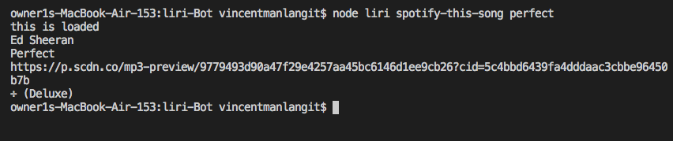
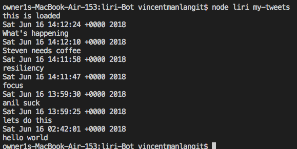
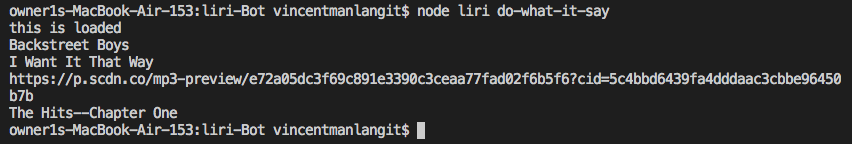

# liri-Bot

Liri-Bot

Runs using nodejs.  Using the terminal following commands can be executed
1) movieThis "movie name"  - will call the movie name, actors, plot, and year created
2) spotify-this-song "song name"  - will call the list of artist, album, and etc..
3) my-tweets - will call the last 20 tweets
4) do-what-it says - will read file from random.txt and execute spotify this song with I want it that way.

Here are the results image:

